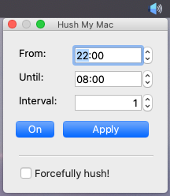

# Hush My Mac (and only Mac!)

## TLDR;

This small app will make a Mac silent during a given timeframe/schedule.

## Why?

I usually forget to silence my MacBook when I go to sleep. Even though I have enabled and scheduled "Do Not Disturb", sounds coming from web browsers are not muted. If I had opened Facebook, WhatsApp Web or any website which gives notifications, they will still make sounds and piss me off!

So, I created a small app which will put my Mac into silence (mute mode) on a schedule.

## How does it work?

This uses `osascript` on MacOS to mute and unmute the Mac. These scripts are executed through a simple Qt application, written in Qt5/C++.

We can define a timeframe (defined by *From* and *Until*) when we want our Mac to be silenced, and the app will try to silence it every *Interval* seconds.

For the moment, this app is not able to extract the current mute/unmute state of the Mac. So, it totally rely on it's internal state which it calculates using the timeframe. So, if we manually mute/unmute our Mac, the app won't know that. 

However, the app can forcefully silence the Mac when we enable "Forcefully Hush" checkbox. Then, it will ignore the states difference between time intervals and mute/unmute the Mac.

For example, if the app had put the Mac into silent mode (mute), it will keep the current state as "muted". And the next time it checks the time, the calculated state is again "muted" and it will not try to mute the Mac again. However, if we have manually unmute the Mac, it will remain unmuted. So overcome this (unless that's what we want), we can check "Forcefully hush!" and it will mute the Mac without checking the previous state.

We also can enable/disable the process by togging the On/Off button, but it will NOT bring back the sounds if it was already put on mute (and vise versa). 

All the settings are saved in a folder inside our user directory (i.e. `/Users/my_name/.hush_my_mac/`).
We have to click "Apply" button to save the settings. This is done to avoid glitches in muting/unmuting the Mac.

## Limitations

1. This only works on MacOs. This app does not work on Windows or Linux.
2. There is capability (yet) to read the current mute status of our Mac. So this will blindly make it mute/unmute.
3. We can't remove the app icon from the Dock.
4. The app will constantly try to mute/unmute. We might need to use a singleshot QTimer to avoid this.
5. We have to manually start the app when we start the Mac.

## How to compile?

1. Install Qt 5+ with Qt Creator.
2. Open the Qt project file in Qt Creator.
3. Click on "build".

## How to run?

### For developers

We can of course run the app using the Qt Creator. But what's fun about that!

Create a DMG file:

1. Go to the build folder for the build config using the terminal.  
   i.e. `cd <path_to_project>/build-HushMyMac-Desktop_Qt_5_13_0_clang_64bit-Release/`
2. Run this command to create the DMG file.  
	`macdeployqt HushMyMac.app -dmg -always-overwrite`
3. Create a DMG file as explained above.
4. Open the DMG file and mount it.
5. Drag and drop the app to the Applications folder.
6. Search for "HushMyMac" on Spotlight search, and we know the rest.

## How to contribute?

Well, I don't know if this is a worthwhile project anyone want to spend time on. But hey, it's making my life easier, so it might do the same for you.

So, if anyone would like to contribute with new features or bugfixes, feel free to create a Pull Request.

Icons are from: [Mute Icon](https://www.flaticon.es/icono-gratis/sin-sonido_3558820), [Unmuted Icon](https://www.flaticon.es/icono-gratis/sonido_3721694)

## Want to motivate me?

 

